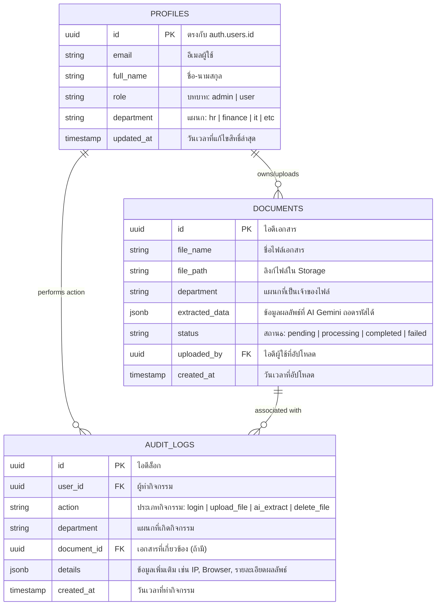

# โครงสร้างฐานข้อมูลระบบจัดการเอกสารแยกแผนกและสิทธิ์ (Database Schema & Audit Logs)

เอกสารนี้ระบุรายละเอียดโครงสร้างตารางฐานข้อมูล (Database Schema) ในระบบ **LowcodeProject** ซึ่งได้รับการออกแบบตามมาตรฐานความปลอดภัยและความเป็นส่วนตัวของข้อมูลแยกตามแผนก

---

## 🗺️ แผนผังความสัมพันธ์ข้อมูล (Entity Relationship)



---

## 💾 สคริปต์ SQL สำหรับสร้างตาราง (SQL DDL Scripts)

คุณสามารถนำสคริปต์นี้ไปรันบน Supabase SQL Editor เพื่อสร้างตารางและเปิดใช้งานสิทธิ์ RLS แยกแผนกได้ทันทีครับ:

```sql
-- =========================================================================
-- 1. ตารางข้อมูลโปรไฟล์ผู้ใช้งาน (Profiles)
-- =========================================================================
CREATE TABLE public.profiles (
    id UUID REFERENCES auth.users(id) ON DELETE CASCADE PRIMARY KEY,
    email TEXT NOT NULL,
    full_name TEXT,
    role TEXT NOT NULL DEFAULT 'user' CHECK (role IN ('admin', 'user')),
    department TEXT NOT NULL DEFAULT 'general',
    updated_at TIMESTAMP WITH TIME ZONE DEFAULT TIMEZONE('utc'::text, NOW())
);

-- =========================================================================
-- 2. ตารางเก็บเอกสารและการประมวลผลของ AI (Documents)
-- =========================================================================
CREATE TABLE public.documents (
    id UUID DEFAULT gen_random_uuid() PRIMARY KEY,
    file_name TEXT NOT NULL,
    file_path TEXT NOT NULL,
    department TEXT NOT NULL,
    extracted_data JSONB,
    status TEXT NOT NULL DEFAULT 'pending' CHECK (status IN ('pending', 'processing', 'completed', 'failed')),
    uploaded_by UUID REFERENCES public.profiles(id) ON DELETE SET NULL,
    created_at TIMESTAMP WITH TIME ZONE DEFAULT TIMEZONE('utc'::text, NOW()) NOT NULL
);

-- =========================================================================
-- 3. ตารางเก็บประวัติความปลอดภัยและการเข้าถึงไฟล์ (Audit Logs)
-- =========================================================================
CREATE TABLE public.audit_logs (
    id UUID DEFAULT gen_random_uuid() PRIMARY KEY,
    user_id UUID REFERENCES public.profiles(id) ON DELETE SET NULL,
    action TEXT NOT NULL,
    department TEXT NOT NULL,
    document_id UUID REFERENCES public.documents(id) ON DELETE SET NULL,
    details JSONB,
    created_at TIMESTAMP WITH TIME ZONE DEFAULT TIMEZONE('utc'::text, NOW()) NOT NULL
);

-- เปิดใช้งานระบบ Row Level Security (RLS) เพื่อป้องกันความปลอดภัยแยกแผนก
ALTER TABLE public.profiles ENABLE ROW LEVEL SECURITY;
ALTER TABLE public.documents ENABLE ROW LEVEL SECURITY;
ALTER TABLE public.audit_logs ENABLE ROW LEVEL SECURITY;
```

---

## 🛡️ กฎการแยกความปลอดภัยข้อมูลรายแผนก (RLS Policies)

เพื่อให้ได้ระดับความปลอดภัยตามมาตรฐานสากล (Global Standard) เราจะตั้งค่าการปกป้องข้อมูลในตารางดังนี้:

### กฎสำหรับตารางเอกสาร (Documents Table Policies)

1. **Admin มองเห็นทั้งหมด**: บัญชีที่เป็น `role = 'admin'` สามารถดู แก้ไข และลบเอกสารทุกตัวของทุกแผนกได้
2. **User มองเห็นเฉพาะแผนกตัวเอง**: บัญชีทั่วไปมองเห็นและแก้ไขได้เฉพาะไฟล์ที่คอลัมน์ `department` ตรงกับ `department` ของบัญชีตนเองเท่านั้น
   ```sql
   CREATE POLICY "Users can access documents from their department" ON public.documents
   FOR ALL USING (
       (SELECT role FROM public.profiles WHERE id = auth.uid()) = 'admin'
       OR department = (SELECT department FROM public.profiles WHERE id = auth.uid())
   );
   ```

### กฎสำหรับตารางประวัติกิจกรรม (Audit Logs Policies)

1. **Admin อ่านประวัติได้ทั้งหมด**: เพื่อควบคุมดูแลภาพรวมความปลอดภัย
2. **ห้าม User หรือผู้พัฒนาแก้ไข Log**: ตั้งนโยบายให้ Log สามารถ **เขียนเข้าได้เท่านั้น (INSERT Only)** ห้ามแก้ ห้ามลบ เพื่อคงความโปร่งใสของประวัติ (Tamper-proof logs)

   ```sql
   -- อนุญาตให้เพิ่มประวัติล็อกได้เท่านั้น ห้ามแก้/ห้ามลบ
   CREATE POLICY "Anyone logged-in can insert logs" ON public.audit_logs
   FOR INSERT WITH CHECK (auth.uid() IS NOT NULL);

   -- เฉพาะแอดมินเท่านั้นที่จะมีสิทธิ์เข้ามาสืบค้นล็อกประวัติ
   CREATE POLICY "Admins can view all audit logs" ON public.audit_logs
   FOR SELECT USING (
       (SELECT role FROM public.profiles WHERE id = auth.uid()) = 'admin'
   );
   ```
